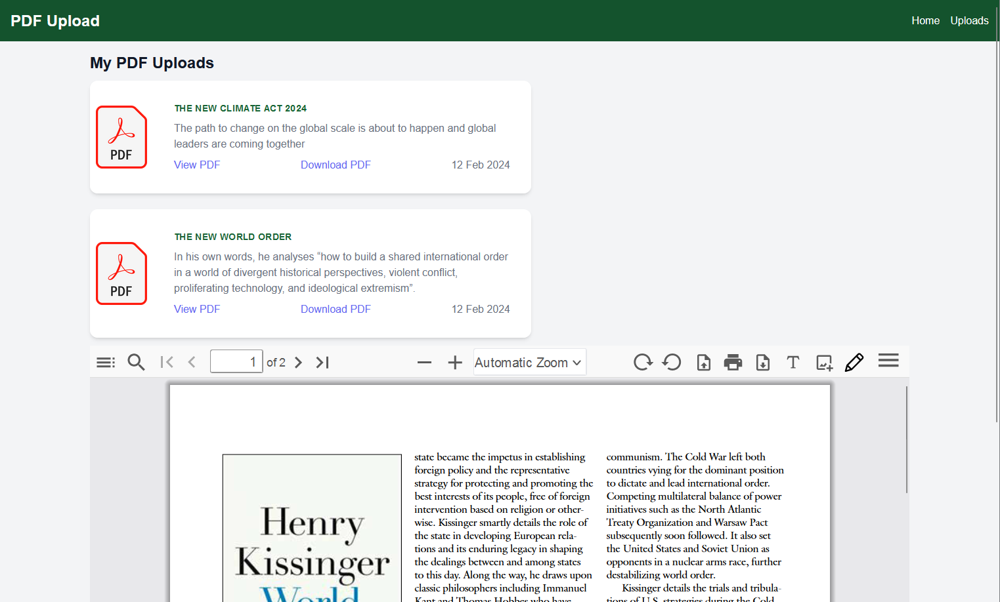

# PDF Uploader and Viewer

## Overview

The PDF Uploader and Viewer is a full-stack application that allows users to upload PDF files, store them in the cloud, and preview them within the application. The backend is built with Node.js and Express, and uses MongoDB for database management and Cloudinary for cloud-based file storage. The frontend is built with Angular.

### Important Notice
please note that there could be potential conflicts with applications like Internet Download Manager (IDM) or other similar download managers. These applications might disrupt the PDF viewing functionality within the application.

To ensure a seamless user experience and the smooth operation of the PDF Uploader and Viewer, we strongly recommend temporarily disabling any active download manager applications while using this app. This will enable you to upload and view PDFs within the application without any hindrance.

## Getting Started

These instructions will guide you through the process of setting up a local development environment.

### Prerequisites

Before you begin, ensure you have the following installed on your local development machine:

- Git - Download & Install Git.
- Node.js - Download & Install Node.js and the npm package manager.
- MongoDB - Download & Install MongoDB, and make sure it's running on the default port (27017) or use a remote mongodb database like atlas
- Cloudinary Account - Create an account on Cloudinary for cloud-based file storage.

### Installation

1. **Clone the repository** from GitHub. Open your terminal, navigate to your working directory and use the following command:
    ```sh
    git clone <repository_link>
    ```

2. **Navigate to the project directory**. Open two separate terminals for the frontend and backend respectively.

3. **Install NPM packages** for both the frontend and backend applications by running the following command in each terminal:
   ```sh
   npm install
   ```

3. **Start the frontend application** by running the following command in the frontend terminal:
    ```sh
    ng serve -o
    ```
    This will start the Angular development server and open the application in your default web browser.

4. **Start the backend server** by running the following command in the backend terminal:
   ```sh
   npm start
   ```
   This will start the Node.js server on your local machine.

With these steps, you should be able to view and interact with the application at http://localhost:4200.

### Backend
The backend server is built with Node.js and Express. It uses MongoDB as the database for storing user data and Cloudinary for storing PDF files. The server is designed to handle requests from the frontend, process them, and send appropriate responses.

### Frontend
The frontend is an Angular application. It provides a user interface for users to interact with the application. It communicates with the backend server to upload PDF files, retrieve them from the cloud, and display them to the user.


### SCREEN SHOTS

